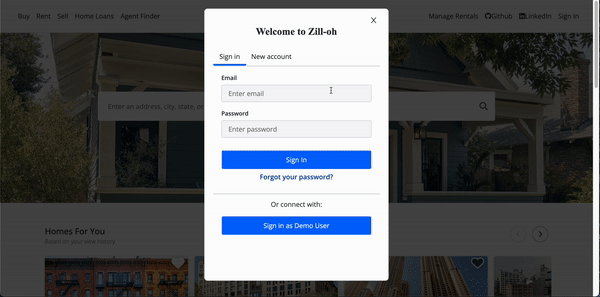
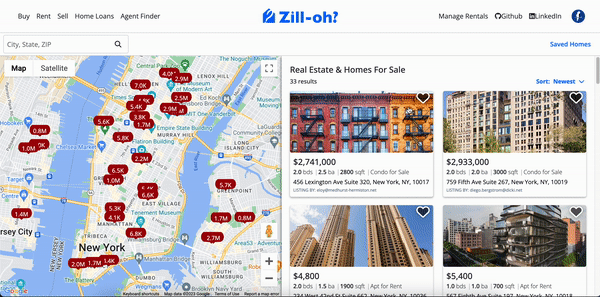
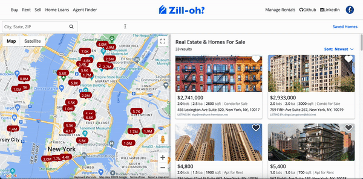
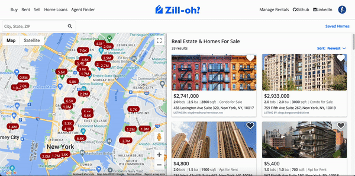

# Zill-oh?

Check out the [live site](https://zilloh.onrender.com)


## Introduction

Zill-oh? is a clone of the Zillow website. Zillow is a home finding/listing service that allows users to shop for homes. This clone mimics the user authentication, listings, favorites, map, and search features of Zillow. Zill-oh? was created within a 14 day timeframe. Please note that on first render, Zill-oh? may take a moment to load due to the Render hosting platform.


## Technologies

* Languages: JavaScript, Ruby, HTML, and CSS
* Backend: Rails
* Frontend: React-Redux
* Databse: PostgreSQL
* Hosting: Render
* Asset Storage: AWS Simple Cloud Storage (S3)
* Other: Google Maps API

## Features

### User Authentication

Zill-oh? users are able to create and log in to an account. Frontend live validation is included on creating an account.\


```js
useEffect(()=>{
    const passValidationOne = document.querySelector('#create-account-password-errors li:nth-child(1)');
    const passValidationTwo = document.querySelector('#create-account-password-errors li:nth-child(2)');
    const passValidationThree = document.querySelector('#create-account-password-errors li:nth-child(3)');
    const passValidationFour = document.querySelector('#create-account-password-errors li:nth-child(4)');
    const createSubmit = document.getElementById('create-submit');
    const passValidations = [passValidationOne, passValidationTwo, passValidationThree, passValidationFour];
    setPasswordValid(true);

    const makeGreen = (validation) => {
        validation.classList.remove('red-error');
        validation.classList.add('green');
        validation.children[1].classList.remove('hidden');
        validation.children[0].classList.add('hidden');
    }

    const makeRed = (validation) => {
        validation.classList.add('red-error');
        validation.classList.remove('green');
        validation.children[0].classList.remove('hidden');
        validation.children[1].classList.add('hidden');
        setPasswordValid(false);
    }

    if (password.length === 0) {
        passValidations.forEach((validation)=>{
            validation.classList.remove('red-error');
            validation.classList.remove('green');
            validation.children[0].classList.add('hidden');
            validation.children[1].classList.add('hidden');
        })
        setPasswordValid(false);
    }
    else {
        if (password.length < 8) {
            makeRed(passValidationOne);
        } else {
            makeGreen(passValidationOne);
        }
        if (!(/\d/.test(password)) || !(/[a-z]/gi).test(password)) {
            makeRed(passValidationTwo);
        } else {
            makeGreen(passValidationTwo);
        }
        if (!(specialRegex.test(password))) {
            makeRed(passValidationThree);
        } else {
            makeGreen(passValidationThree)
        }
        if (!(/[A-Z]/.test(password)) || !(/[a-z]/.test(password))) {
            makeRed(passValidationFour);
        } else {
            makeGreen(passValidationFour);
        }
    }   
    if (passwordValid && emailValid && createSubmit) {
        createSubmit.removeAttribute('disabled');
    }
}, [password, specialRegex])
```

### Listings

Zill-oh? allows users to create, read, update, and delete home listings. Listings are stored in the database and are accessed via api fetch calls to the Rails backend server.


```js
export const fetchListings = () => async dispatch => {
    const res = await csrfFetch('/api/listings');
    const data = await res.json();
    const listings = {};
    data.forEach((el)=>{
        listings[el.listing.id] = el.listing
    })
    dispatch(setListings(listings));
}

function listingsReducer(state={}, action) {
    let newState = {...state}
    switch (action.type) {
        case SET_LISTINGS:
            return {...action.listings};
        case ADD_LISTING:
            newState[action.listing.id] = action.listing;
            return newState;
        case REMOVE_LISTING:
            delete newState[action.listingId];
            return newState;
        default:
            return state;
    }
}
```

### Favorites

Users can "favorite" a listing. This saves their the listing on their saved homes page. Favorites are included as a joins table in the database and are included in the global Redux state.



```js
const toggleLiked = (e) => {
    e.preventDefault();
    e.stopPropagation();
    if (!sessionUser) {
        dispatch(setModal(true))
        return;
    }
    if (liked === true) {
        setLiked(false);
        let favorite = Object.values(favorites).filter((favorite) => {
            return (favorite.listingId === listing.id) && (favorite.userId === sessionUser.id)
        })
        dispatch(deleteFavorite(favorite[0].id))
    } else {
        setLiked(true);
        dispatch(createFavorite({listingId: listing.id, userId: sessionUser.id}))
    }
}
```

### Search

Users can search on the index page for homes by city, state, or zip code. This search queries the database and returns only homes fitting the search parameters.



```ruby
def index
    query_string = params[:q]
    if !query_string || query_string === ""
        @listings = Listing.all
    else
        @listings = Listing.where('zipcode = ?', query_string).or(Listing.where('city = ?', query_string)).or(Listing.where('state = ?', query_string))
    end
    render 'api/listings/index'
end
```

### Map

Users are able to view listing locations via a google map api. Selecting a pin takes a user to a listing show page.



```js
<GoogleMap zoom={13} center={{lat: 40.735, lng: -73.99}} mapContainerClassName="map-container">
    {Object.values(listings).map((listing) => {
        return <MarkerObject key={listing.id} listing={listing}/>
    })
    }
</GoogleMap>
```
```js
<Marker className="marker"
onClick={() => { history.replace(`/homes/${listing.id}`)}}
value={listing.id}
onMouseOver={() => {setHovering(true);}}
onMouseOut={()=> { setHovering(false)}}
label = {{text: formattedPrice, color: 'white', fontFamily: "'Open Sans', sans-serif"}}
zIndex = {(hovering && 200) || Math.floor(Math.random() * -100)}
icon = {(!hovering && markerImage1) || markerImage2}
position={{lat: parseFloat(listing.latitude), lng: parseFloat(listing.longitude)}} />
```